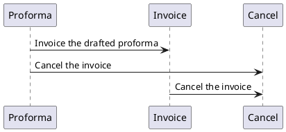

# Finance

## Invoice

### getWorkflow

The workflow encapsulates a comprehensive definition for invoice management.
It delineates three distinct states: 'proforma', 'invoice', and 'cancelled'.
Within each state, defined transitions dictate permissible actions, such as transitioning from 'proforma' to 'invoice' upon completion or reverting to 'cancelled' status if needed.

### Properties

| Property                | Type       | Description                                                                      | Value(s)                                                    |
|-------------------------|------------|----------------------------------------------------------------------------------|-------------------------------------------------------------|
| name                    | alias      | Alias of invoice_number                                                          |                                                             |
| reference               | string     | Note or comments to be addressed to the customer                                 |                                                             |
| organisation_id         | many2one   | The organisation that emitted/received the invoice                               |                                                             |
| status                  | string     | Current status of the invoice                                                    | (proforma, invoice, cancelled)                              |
| invoice_type            | string     | Current type of the invoice                                                      | (invoice, credit_note)                                      |
| invoice_purpose         | string     | The purpose of the invoice                                                       | (sell, buy)                                                 |
| invoice_number          | string     | Number of the invoice, according to organization logic                           |                                                             |
| reversed_invoice_id     | many2one   | Credit note that was created for cancelling the invoice                          |                                                             |
| payment_status          | string     | Current payment status of the invoice                                            | (pending, overdue, debit_balance, credit_balance, balanced) |
| payment_reference       | string     | Message for identifying payments related to the invoice                          |                                                             |
| emission_date           | datetime   | The emission data is set when the invoice change status from proforma to invoice |                                                             |
| due_date                | date       | Deadline for the payment is expected                                             |                                                             |
| total                   | computed   | Total tax-excluded price of the invoice                                          |                                                             |
| price                   | computed   | Final tax-included invoiced amount                                               |                                                             |
| invoice_lines_ids       | one2many   | Detailed lines of the invoice                                                    |                                                             |
| invoice_line_groups_ids | one2many   | Groups of lines of the invoice                                                   |                                                             |
| accounting_entries_ids  | one2many   | Accounting entries relating to the lines of the invoice                          |                                                             |

## Invoice Line

### Properties

| Property               | Type     | Description                                                      | Value(s) |
|------------------------|----------|------------------------------------------------------------------|----------|
| name                   | string   | Default label of the line                                        |          |
| description            | string   | Complementary description of the line (independent from product) |          |
| invoice_line_group_id  | many2one | Group related (to their invoice) for lines                       |          |
| invoice_id             | many2one | Invoice the line is related to                                   |          |
| unit_price             | float    | Unit price of the product related to the line                    |          |
| vat_rate               | float    | VAT rate to be applied                                           |          |
| qty                    | float    | Quantity of product                                              |          |
| free_qty               | integer  | Free quantity of the product                                     |          |
| discount               | float    | Total amount of discount to apply, if any                        |          |
| total                  | computed | Total tax-excluded price of the line                             |          |
| price                  | computed | Final tax-included price of the line                             |          |
| downpayment_invoice_id | many2one | Downpayment invoice (for invoiced downpayment)                   |          |

## Invoice Line Group

### Properties

| Property               | Type     | Description                                           | Value(s) |
|------------------------|----------|-------------------------------------------------------|----------|
| name                   | string   | Label of the group (displayed on invoice)             |          |
| description            | string   | Short description of the group (displayed on invoice) |          |
| invoice_id             | many2one | Invoice the line is related to                        |          |
| invoice_lines_ids      | one2many | Detailed lines of the group                           |          |

# Tax

## Vat Rule

### Properties

| Property     | Type     | Description                                               | Value(s)         |
|--------------|----------|-----------------------------------------------------------|------------------|
| name         | string   | Label of the group (displayed on invoice)                 |                  |
| rate         | float    | Short description of the group (displayed on invoice)     |                  |
| type         | string   | Kind of operation this rule relates to                    | (purchase, sale) |
| account_id   | many2one | Account which the tax amount relates to                   |                  |

