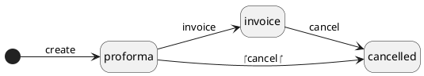

# Finance

## Invoice

### getWorkflow

The workflow encapsulates a comprehensive definition for invoice management.
It delineates three distinct states: 'proforma', 'invoice', and 'cancelled'.
Within each state, defined transitions dictate permissible actions, such as transitioning from 'proforma' to 'invoice' upon completion or reverting to 'cancelled' status if needed.

#### Statues
- proforma: Draft invoice that is being completed.
- invoice: Invoice can no longer be modified.
- cancelled:  The invoice was cancelled.

#### Transitions
- proforma
    - invoice: Invoice the drafted proforma.
    - cancel: Cancel the invoice.
- invoice 
    - cancel: Cancel the invoice.

### Properties

| Property                | Type     | Description                                                                      | Value(s)                                                    |
|-------------------------|----------|----------------------------------------------------------------------------------|-------------------------------------------------------------|
| name                    | alias    | Alias of invoice_number                                                          |                                                             |
| reference               | string   | Note or comments to be addressed to the customer                                 |                                                             |
| organisation_id         | many2one | The organisation that emitted/received the invoice                               |                                                             |
| status                  | string   | Current status of the invoice                                                    | (proforma, invoice, cancelled)                              |
| invoice_type            | string   | Current type of the invoice                                                      | (invoice, credit_note)                                      |
| invoice_purpose         | string   | The purpose of the invoice                                                       | (sell, buy)                                                 |
| invoice_number          | string   | Number of the invoice, according to organization logic                           |                                                             |
| reversed_invoice_id     | many2one | Credit note that was created for cancelling the invoice                          |                                                             |
| payment_status          | string   | Current payment status of the invoice                                            | (pending, overdue, debit_balance, credit_balance, balanced) |
| payment_reference       | string   | Message for identifying payments related to the invoice                          |                                                             |
| emission_date           | datetime | The emission data is set when the invoice change status from proforma to invoice |                                                             |
| due_date                | date     | Deadline for the payment is expected                                             |                                                             |
| total                   | float    | Total tax-excluded price of the invoice (computed from invoice_lines_ids.total)  |                                                             |
| price                   | float    | Final tax-included invoiced amount (computed from invoice_lines_ids.price)       |                                                             |
| invoice_lines_ids       | one2many | Detailed lines of the invoice                                                    |                                                             |
| invoice_line_groups_ids | one2many | Groups of lines of the invoice                                                   |                                                             |
| accounting_entries_ids  | one2many | Accounting entries relating to the lines of the invoice                          |                                                             |

## Invoice Line

### Properties

| Property               | Type     | Description                                                              | Value(s) |
|------------------------|----------|--------------------------------------------------------------------------|----------|
| name                   | string   | Default label of the line                                                |          |
| description            | string   | Complementary description of the line (independent from product)         |          |
| invoice_line_group_id  | many2one | Group related (to their invoice) for lines                               |          |
| invoice_id             | many2one | Invoice the line is related to                                           |          |
| unit_price             | float    | Unit price of the product related to the line                            |          |
| vat_rate               | float    | VAT rate to be applied                                                   |          |
| qty                    | float    | Quantity of product                                                      |          |
| free_qty               | integer  | Free quantity of the product                                             |          |
| discount               | float    | Total amount of discount to apply, if any                                |          |
| total                  | float    | Total tax-excluded price of the line  (computed from unit_price and qty) |          |
| price                  | float    | Final tax-included price of the line  (computed from total and vat_rate)         |          |
| downpayment_invoice_id | many2one | Downpayment invoice (for invoiced downpayment)                           |          |

## Invoice Line Group

### Properties

| Property               | Type     | Description                                           | Value(s) |
|------------------------|----------|-------------------------------------------------------|----------|
| name                   | string   | Label of the group (displayed on invoice)             |          |
| description            | string   | Short description of the group (displayed on invoice) |          |
| invoice_id             | many2one | Invoice the line is related to                        |          |
| invoice_lines_ids      | one2many | Detailed lines of the group                           |          |

## Vat Rule

### Properties

| Property       | Type     | Description                                               | Value(s)         |
|----------------|----------|-----------------------------------------------------------|------------------|
| name           | string   | Label of the group (displayed on invoice)                 |                  |
| rate           | float    | Short description of the group (displayed on invoice)     |                  |
| vat_rule_type  | string   | Kind of operation this rule relates to                    | (purchase, sale) |
| account_id     | many2one | Account which the tax amount relates to                   |                  |

## Account Chart

### Properties

| Property     | Type     | Description                                               | Value(s)         |
|--------------|----------|-----------------------------------------------------------|------------------|
| name         | string   | Label of the group (displayed on invoice)                 |                  |
| rate         | float    | Short description of the group (displayed on invoice)     |                  |
| type         | string   | Kind of operation this rule relates to                    | (purchase, sale) |
| account_id   | many2one | Account which the tax amount relates to                   |                  |

## Account Chart Line

### Properties

| Property                   | Type      | Description                                                      | Value(s)                                                                         |
|----------------------------|-----------|------------------------------------------------------------------|----------------------------------------------------------------------------------|
| name                       | alias     | Name of the account.                                             |                                                                                  |
| code                       | string    | A variable length string representing the number of the account. |                                                                                  |
| description                | string    | Short description of the account.                                |                                                                                  |
| account_chart_id           | many2one  | The chart of accounts the line belongs to                        |                                                                                  |
| analytic_section_id        | many2one  | Related analytic section, if any                                 |                                                                                  |
| nature                     | string    | The nature of the Account Chart Line                             | (Business balance, Management)                                                   |
| accounting_chart_line_type | string    | The type of the Account Chart Line                               | (debt, bank, current_asset, fixed_asset, prepayment, fixed_assets, payable, ...) |
| is_visible                 | boolean   | Flag to switch visibility of the account                         |                                                                                  |

## Accounting Entry

### Properties

| Property         | Type     | Description                                  | Value(s) |
|------------------|----------|----------------------------------------------|----------|
| name             | string   | Label for identifying the entry              |          |
| has_invoice      | boolean  | Signals that the entry relates to an invoice |          |
| invoice_id       | many2one | Invoice that the line relates to             |          |
| invoice_line_id  | many2one | Invoice line the entry relates to            |          |
| has_order        | boolean  | Signals that the entry relates to an order   |          |
| order_id         | many2one | Order that the line relates to               |          |
| order_line_id    | many2one | Order line the entry relates to              |          |
| account_id       | many2one | Accounting account the entry relates to      |          |
| journal_id       | many2one | Accounting journal the entry relates to      |          |
| debit            | float    | Amount to be received                        |          |
| credit           | float    | Amount to be disbursed                       |          |

## Accounting Journal

### Properties

| Property                        | Type       | Description                                | Value(s)                                                      |
|---------------------------------|------------|--------------------------------------------|---------------------------------------------------------------|
| name                            | string     | Label for identifying the journal          |                                                               |
| description                     | string     | Verbose detail of the role of the journal  |                                                               |
| code                            | string     | Unique code (optional)                     |                                                               |
| accounting_journal_type         | string     | Type of journal or ledger                  | (general_ledger, sales, purchases, bank_cash, miscellaneous)  |
| organisation_id                 | many2one   | The organisation the journal belongs to    |                                                               |
| accounting_entries_ids          | one2many   | Accounting entries relating to the journal |                                                               |

## Accounting Rule

### Properties

| Property                   | Type       | Description                                    | Value(s)           |
|----------------------------|------------|------------------------------------------------|--------------------|
| name                       | string     | Name of the accounting rule                    |                    |
| description                | string     | Short description of the rule to serve as memo |                    |
| accounting_rule_type       | string     | Kind of operation this rule relates to         | (purchase, sale)   |
| accounting_entries_ids     | one2many   | Accounting entries relating to the journal     |                    |
| stat_section_id            | many2one   | Related stat section, if any                   |                    |
| vat_rule_id                | many2one   | VAT rule the line is related to                |                    |
| prices_ids                 | one2many   | Prices that relate to the accounting rule      |                    |

## Accounting Rule Line

### Properties

| Property              | Type       | Description                                              | Value(s) |
|-----------------------|------------|----------------------------------------------------------|----------|
| name                  | string     | Name of the accounting rule line                         |          |
| account               | string     | Code of the related account  (computed from  account_id) |          |
| account_id            | many2one   | Account which the tax amount relates to                  |          |
| share                 | float      | Share of the line, in percent (lines sum must be 100%)   |          |
| accounting_rule_id    | many2one   | Parent accounting rule this line is related to           |          |

## Analytic Chart

### Properties

| Property               | Type        | Description                                      | Value(s) |
|------------------------|-------------|--------------------------------------------------|----------|
| name                   | string      | Name of the analytical chart of accounts         |          |
| organisation_id        | many2one    | The organisation the chart belongs to            |          |
| analytic_sections_ids  | one2many    | Sections that are related to this analytic chart |          |

## Analytic Section

### Properties

| Property          | Type       | Description                                | Value(s) |
|-------------------|------------|--------------------------------------------|----------|
| name              | alias      | The code if the section (from code)        |          |
| code              | string     | Unique code identifying the section        |          |
| description       | string     | Short description of the section           |          |
| is_locked         | boolean    | Can the section be updated                 |          |
| label             | string     | The label of the section                   |          |
| analytic_chart_id | many2one   | The chart of accounts the line belongs to. |          |

## Stat Chart

### Properties

| Property          | Type        | Description                                  | Value(s) |
|-------------------|-------------|----------------------------------------------|----------|
| name              | alias       | Name of the chart of accounts                |          |
| organisation_id   | many2one    | The organisation the chart belongs to        |          |
| stat_sections_ids | one2many    | Sections that are related to this stat chart |          |

## Stat Section

### Properties

| Property        | Type     | Description                                      | Value(s) |
|-----------------|----------|--------------------------------------------------|----------|
| name            | alias    | Name of the section of accounts (from code)      |          |
| code            | string   | Unique code identifying the section              |          |
| description     | string   | Short description of the section                 |          |
| label           | string   | The label of the section                         |          |
| stat_chart_id   | many2one | The stats chart the line belongs to              |          |

