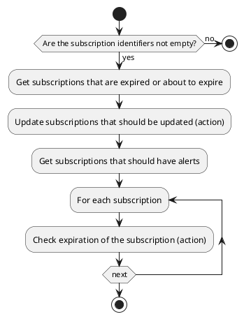

# Subscription actions

## Bulk Expiration

Update and check if the subscription is expired or about to expire.

### Params

| Param | Type     | Required | Description                        |
|-------|----------|:--------:|------------------------------------|
| ids   | many2one |          | List of subscription identifiers   |

### Uml

