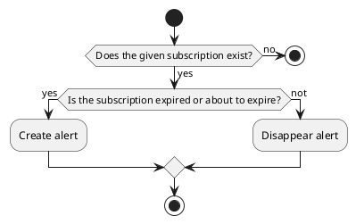

# Subscription actions

## Check Expiration

Check if the subscription is expired or about to expire. 
If either of these fields is true, there will be an alert; otherwise, the alert will disappear.

### Params

| Param | Type    | Required | Description             |
|-------|---------|:--------:|-------------------------|
| id    | integer |    x     | ID of the subscription  |

### Uml

