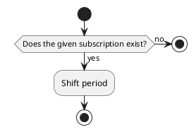
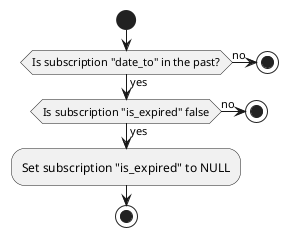
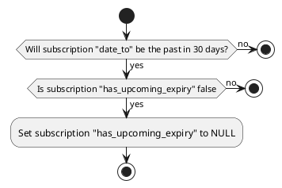

# Subscription actions

## Add subscription entry

## Shift period

This action shift the period of a subscription to the next one, it modifies *date_from* and *date_to* depending on the *duration*.

For example, if a subscription:

* *date_from* is **2024-01-15**
* *date_to* is **2024-02-15**
* *duration* is **monthly**

then after the shift:
* *date_from* becomes 2024-**02**-15
* *date_to* becomes 2024-**03**-15

### Params

| Param | Type    | Required | Description     |
|-------|---------|:--------:|-----------------|
| id    | integer |    x     | Subscription id |

### Uml

## Update expirations

This action updates expiration values of all subscriptions when needed, is meant to be run at every start of day.
It allows to always keep the fields *is_expired* and *has_upcoming_expiry* to a correct value.

It will:

* Sets *is_expired* to null for all subscriptions that date_to is in the past and *is_expired* is false.
* Sets *has_upcoming_expiry* to null for all subscriptions that date_to will be in the past in 30 days and *has_upcoming_expiry* is false.

The fields *is_expired* and *has_upcoming_expiry* are computed, this is why the action set their values to null and not to true.

### Params

None

### Uml

Example with one subscription for *is_expired* update:

Example with one subscription for *has_upcoming_expiry* update:

