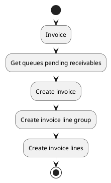

# Receivable queue actions

## Invoice

Invoice pending receivables of selected queues.
Create invoice lines from pending receivables of selected queues.
Create new invoice if no pending proforma found for customer.

### Params

| Param      | Type     | Required | Description                                                                                     | Value(s) |
|------------|----------|:--------:|-------------------------------------------------------------------------------------------------|----------|
| id         | integer  |          | Identifier of the targeted sale entry                                                           |          |
| ids        | one2many |          | Identifier of the targeted sale entries                                                         |          |
| invoice_id | many2one |          | Invoice to which the lines must be added. If left empty a new invoice proforma will be created. |          |

### Uml

