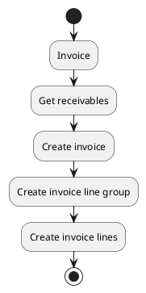
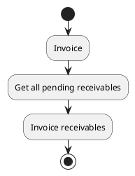

# Receivable actions

## Invoice

Invoice pending receivable, a default invoice can be selected, all receivables from that invoice\'s customer will be added to it.

### Params

| Param                   | Type     | Required | Description                                                                                     | Value(s) |
|-------------------------|----------|:--------:|-------------------------------------------------------------------------------------------------|----------|
| id                      | integer  |          | Identifier of the targeted sale entry                                                           |          |
| ids                     | one2many |          | Identifier of the targeted sale entries                                                         |          |
| invoice_id              | many2one |          | Invoice to which the lines must be added. If left empty a new invoice proforma will be created. |          |
| invoice_line_group_name | string   |          | Name of the invoice line group.                                                                 |          |

### Uml

## Bulk invoice

Invoice all pending receivables on customers' default invoices.

### Uml

