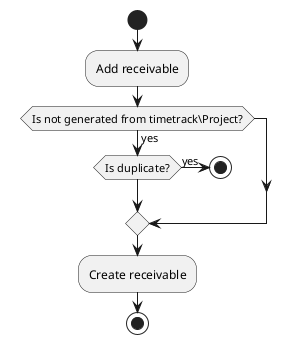
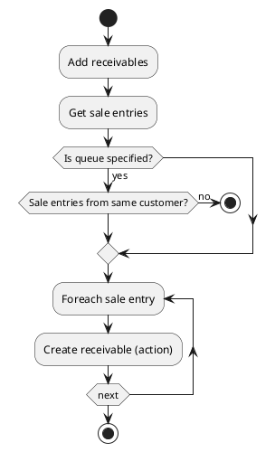

# Sale entry actions

## Add receivable

Create a receivable from the given sale entry.
Allows receivable for same product only when the sale entry is created for a timetrack\Project.
A receivable queue can be specified, if not the receivable is added to the first queue.

### Params

| Param                | Type     | Required | Description                                                      | Value(s) |
|----------------------|----------|:--------:|------------------------------------------------------------------|----------|
| id                   | integer  |    x     | Identifier of the targeted sale entry                            |          |
| receivables_queue_id | many2one |          | Customer receivable queue to which the receivable will be added. |          |

### Uml

## Add receivables

Create receivables from the given sale entries.
If a queue is specified then all receivables must be from same customer.

### Params

| Param                | Type     | Required | Description                                                      | Value(s) |
|----------------------|----------|:--------:|------------------------------------------------------------------|----------|
| ids                  | one2many |    x     | Identifier of the targeted sale entries                          |          |
| receivables_queue_id | many2one |          | Customer receivable queue to which the receivable will be added. |          |

### Uml

