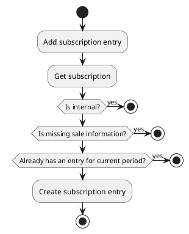
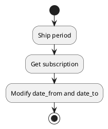
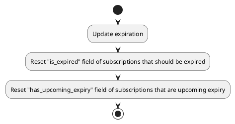
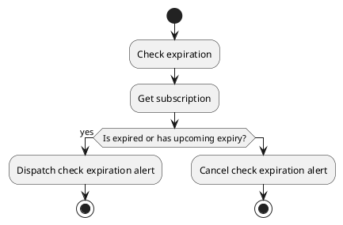
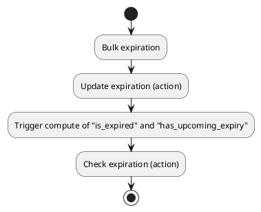

# Subscription actions

## Add Subscription Entry

Generate a new subscription entry from a subscription current period.

### Params

| Param      | Type     | Required | Description                             | Value(s) |
|------------|----------|:--------:|-----------------------------------------|----------|
| id         | integer  |          | Identifier of the targeted subscription |          |

### Uml

## Shift period

Shift the subscription to the next period depending on the duration type.
The duration type are monthly, quarterly, half-yearly or yearly.

### Params

| Param      | Type     | Required | Description                             | Value(s) |
|------------|----------|:--------:|-----------------------------------------|----------|
| id         | integer  |          | Identifier of the targeted subscription |          |

### Uml

## Update expiration

Reset expiration columns "is_expired" and "has_upcoming_expiry" depending on current date and fields "date_from" & "date_to".
This action is meant to be run on each start of day to keep the expiration columns valid.
Field has_upcoming_expiry is reset if the subscription is going to expire in less than 30 days.

The fields "is_expired" and "has_upcoming_expiry" are reset, instead of set to true, because they are computed fields.

### Params

| Param | Type     | Required | Description                               | Value(s) |
|-------|----------|:--------:|-------------------------------------------|----------|
| ids   | one2many |    X     | Identifiers of the targeted subscriptions |          |

### Uml

## Check expiration

This action is used to alert users to check the expiration of a subscription.
If a subscription is expired or has upcoming expiry it generates a check expiration alert, else it discards the alert.

### Params

| Param | Type     | Required | Description                             | Value(s) |
|-------|----------|:--------:|-----------------------------------------|----------|
| id    | integer  |    X     | Identifier of the targeted subscription |          |

### Uml

## Bulk expiration

Re-compute expiration columns "is_expired" and "has_upcoming_expiry" of subscriptions.
It also checks expirations alerts of subscriptions.

If empty ids given the action target all subscriptions.

### Params

| Param | Type     | Required | Description                              | Value(s) |
|-------|----------|:--------:|------------------------------------------|----------|
| ids   | one2many |          | Identifier of the targeted subscriptions |          |

### Uml

