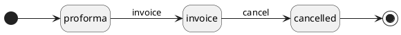

# Invoice classes

## Invoice

This class extends finance\accounting\Invoice, the invoice_purpose field is forced to "sell" value.
The invoice_number field is computed from the setting "sale.invoice.sequence" who is different depending on the organisation.

### Properties

| Property                | Type     | Description                                                                   | Value(s) |
|-------------------------|----------|-------------------------------------------------------------------------------|----------|
| customer_id             | many2one | The counter party organization the invoice relates to                         |          |
| customer_ref            | string   | Reference that must appear on invoice (requested by customer)                 |          |
| is_deposit              | boolean  | Marks the invoice as a deposit one, relating to a downpayment                 |          |
| payment_terms_id        | many2one | The payment terms to apply to the invoice                                     |          |
| funding_id              | many2one | The funding related to the invoice                                            |          |
| **FinanceInvoice**      |          |                                                                               |          |
| organisation_id         | many2one | The organization that emitted the invoice                                     |          |
| invoice_purpose         | string   | Is a invoice concerning a sale to a customer or a buy from a supplier         | sell     |
| invoice_number          | string   | Number of the invoice, according to organization logic (computed)             |          |
| payment_reference       | string   | Message for identifying payments related to the invoice (from invoice number) |          |
| due_date                | date     | Deadline for the payment is expected (from payment terms)                     |          |
| invoice_lines_ids       | one2many | Detailed lines of the invoice                                                 |          |
| invoice_line_groups_ids | one2many | Groups of lines of the invoice                                                |          |

### Workflow

**Statuses**:

- **proforma**: Draft invoice, fields can be edited and lines can be added. If deleted all linked receivable will be set back to pending.
- **invoice**: The invoice number was assigned, only "payment_status" and "customer_ref" field can be edited. Cannot be deleted but can be cancelled.
- **cancel**: A canceled invoice cannot be modified nor deleted.

**Transitions**:

- **invoice**: The transition can be applied only if the proforma has at least one invoice line.
- **cancel**: Linked receivables can either be set back to pending or set to canceled with the invoice.

## Invoice Line

This class extends finance\accounting\InvoiceLine, it adds some fields needed for the sale package.
A sale invoice line is linked to a product and a price. It can originate from a receivable.

### Properties

| Property               | Type     | Description                                                         | Value(s)            |
|------------------------|----------|---------------------------------------------------------------------|---------------------|
| product_id             | many2one | The product (SKU) the line relates to                               |                     |
| price_id               | many2one | The price the line relates to (assigned at line creation)           |                     |
| receivable_id          | many2one | Receivable at the origin of the invoice line                        |                     |
| has_receivable         | boolean  | True if the line origins from a receivable                          |                     |
| **FinanceInvoiceLine** |          |                                                                     |                     |
| name                   | string   | The name of the line (from product)                                 |                     |
| invoice_line_group_id  | many2one | Group the line relates to (in turn, groups relate to their invoice) |                     |
| invoice_id             | many2one | Invoice the line is related to                                      |                     |
| unit_price             | float    | Unit price of the product related to the line (from price)          |                     |
| vat_rate               | float    | Vat rate of the price related to the line (from price)              |                     |

## Invoice Line Group

This class extends finance\accounting\InvoiceLineGroup.

### Properties

| Property                    | Type     | Description                          | Value(s)            |
|-----------------------------|----------|--------------------------------------|---------------------|
| **FinanceInvoiceLineGroup** |          |                                      |                     |
| invoice_line_group_id       | many2one | Invoice the line group is related to |                     |
| invoice_id                  | many2one | Detailed lines of the group          |                     |
