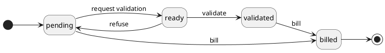

# Sale entry class

## Sale entry

Sale entries are used to describe sales (the action of selling a good or a service).

In addition, this class is meant to be used as an OOP interface for entities meant to describe something that can be sold.
It is extended by sale\subscription\SubscriptionEntry and timetrack\TimeEntry (only time entries use the validation process).

### Properties

| Property             | Type     | Description                                                   | Value(s)                            |
|----------------------|----------|---------------------------------------------------------------|-------------------------------------|
| code                 | string   | Entry auto generated identifier code                          |                                     |
| description          | string   | Description of the entry                                      |                                     |
| name                 | string   | Short readable identifier of the entry                        |                                     |
| detailed_description | string   | Detailed description of the entry                             |                                     |
| has_receivable       | boolean  | The entry is linked to a receivable entry                     |                                     |
| receivable_id        | many2one | The receivable entry the sale entry is linked to              |                                     |
| is_billable          | boolean  | Flag telling if the entry can be billed to the customer       |                                     |
| customer_id          | many2one | The Customer to who refers the item                           |                                     |
| product_id           | many2one | Product of the catalog sale                                   |                                     |
| price_id             | many2one | Price of the sale                                             |                                     |
| unit_price           | float    | Unit price of the product related to the entry                |                                     |
| qty                  | float    | Quantity of product                                           |                                     |
| free_qty             | integer  | Free quantity of product, if any                              |                                     |
| discount             | float    | Total amount of discount to apply, if any                     |                                     |
| object_class         | string   | Class of the object object_id points to                       |                                     |
| object_id            | integer  | Identifier of the object the sale entry originates from       |                                     |
| subscription_id      | many2one | Identifier of the subscription the sale entry originates from |                                     |
| project_id           | many2one | Identifier of the Project the sale entry originates from      |                                     |
| receivable_name      | string   | Name given to the generated receivable                        |                                     |
| status               | string   | Status of the sale entry                                      | (pending, ready, validated, billed) |

### Workflow

**Statuses**:

- **pending**: The entry is still being modified by the creator.
- **ready**: The entry was completed and is ready for the validation process.
- **validated**: The entry was accepted as valid and can now be billed to the customer.
- **billed**: The entry was billed to the customer.

**Transitions**:

- **request validation**: Request approval of the entry.
- **validate**: Validate the entry data, it can be billed.
- **refuse**: Refuse the entry data, it needs some modifications.
- **bill**: Bill from pending means that the validation process is not necessary. This transaction creates a receivable that can be invoiced to the customer.
