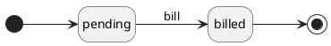

# Subscription classes

## Subscription

A subscription is a recurring payment model where a customer pays regularly, typically monthly or annually, to access a product or service.
An internal subscription is used by your business, so it can't be invoiced to customers.

### Properties

| Property                 | Type     | Description                                | Value(s)                                  |
|--------------------------|----------|--------------------------------------------|-------------------------------------------|
| name                     | string   | Name of the subscription                   |                                           |
| description              | string   | Information about a subscription           |                                           |
| date_from                | date     | Start date of subscription                 |                                           |
| date_to                  | date     | End date of subscription                   |                                           |
| duration                 | string   | Type of the duration                       | (monthly, quarterly, half-yearly, yearly) |
| is_auto_renew            | boolean  | The subscription is auto renew             |                                           |
| is_expired               | boolean  | The subscription is expired                |                                           |
| has_upcoming_expiry      | boolean  | The subscription is  upcoming expiry       |                                           |
| ref_order                | string   | Subscription reference number              |                                           |
| license_key              | string   | Subscription license key                   |                                           |
| customer_id              | many2one | The Customer concerned by the subscription |                                           |
| is_billable              | boolean  | Can be billed to the customer              |                                           |
| product_id               | many2one | Product of the catalog sale                |                                           |
| price_id                 | many2one | Price of the sale                          |                                           |
| price                    | float    | Price of the subscription                  |                                           |
| subscription_entries_ids | one2many | Subscription entries of the subscription   |                                           |

## Subscription Entry

Subscription entry extends sale\SaleEntry, it is used to bill subscriptions.

### Properties

| Property      | Type     | Description                                             | Value(s)                       |
|---------------|----------|---------------------------------------------------------|--------------------------------|
| date_from     | date     | Start date of the subscription period this entry covers |                                |
| date_to       | date     | End date of the subscription period this entry covers   |                                |
| **SaleEntry** |          |                                                         |                                |
| qty           | float    | Quantity of product                                     | 1                              |
| object_class  | string   | Class of the object object_id points to                 | sale\subscription\Subscription |
| product_id    | many2one | Product of the catalog sale                             |                                |
| customer_id   | many2one | The Customer to who refers the item                     |                                |
| is_billable   | boolean  | Can be billed to the customer                           |                                |

### Workflow

The sale\SaleEntry validation process (ready, validated) is not used for subscription entry.

**Statuses**:

- **pending**: The entry is still being modified.
- **billed**: The entry was billed to the customer.

**Transitions**:

- **bill**: Creates a receivable that can be invoiced to the customer.
