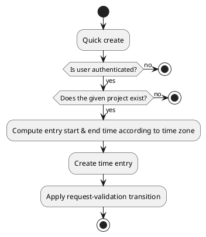

# Time entry actions

## Quick create

Create a new time entry for given project and set its status to ready for validation.
The time entry end time will be set to the current time rounded to a quarter of an hour.
If a _30 minutes_ entry is created at _14:07_ the start time will be _13:30_ and the end time will be _14:00_.
The time is set according to the time zone setting.

### Params

| Param       | Type     | Required | Description                                                  | Value(s)                           |
|-------------|----------|:--------:|--------------------------------------------------------------|------------------------------------|
| project_id  | many2one |    x     | Project the time entry concerns                              |                                    |
| origin      | string   |    x     | Origin of the time entry                                     | (project, backlog, email, support) |
| reference   | string   |          | Reference completing the origin                              |                                    |
| description | string   |    x     | Short description                                            |                                    |
| duration    | time     |          | Task duration in seconds (default 900 seconds => 15 minutes) |                                    |

### Uml

