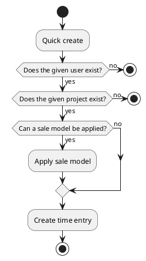

# Time entry actions

## Quick create

Create quickly a new time entry that is meant to be modified inline.
The user (usually the authenticated one), project and the origin are the only needed data to create quickly a new time entry.

To get the most of this feature, time entry sale models need to be configured.
It will set the sale information of the created time entry.

### Params

| Param      | Type     | Required | Description                       | Value(s)              |
|------------|----------|:--------:|-----------------------------------|-----------------------|
| user_id    | many2one |    x     | User that realised the time entry |                       |
| project_id | many2one |    x     | Project the time entry concerns   |                       |
| origin     | string   |    x     | Origin of the time entry          | backlog/email/support |

### Uml

