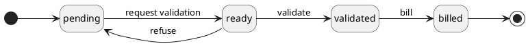

# Timetrack classes

## Time entry

This class extends sale\SaleEntry, this means that receivables can be generated from time entries.

### Properties

| Property             | Type     | Description                                                                                   | Value(s)                                       |
|----------------------|----------|-----------------------------------------------------------------------------------------------|------------------------------------------------|
| date                 | date     | Date of the entry                                                                             |                                                |
| time_start           | time     | Start time of the entry                                                                       |                                                |
| time_end             | time     | End time of the entry                                                                         |                                                |
| duration             | time     | Duration of the entry (from time start and time end)                                          |                                                |
| qty                  | float    | Quantity in hours (from duration)                                                             |                                                |
| user_id              | many2one | User the time entry was performed by                                                          |                                                |
| origin               | string   | What the task performed is a response to                                                      | (project, backlog, email, support)             |
| ticket_id            | integer  | Identifier of the support ticket                                                              |                                                |
| ticket_link          | string   | Support ticket link for quick access (from ticket id and project instance link)               | {instance_id.url}/support/#/ticket/{ticket_id} |
| reference            | string   | Reference completing the origin                                                               |                                                |
| **SaleEntry**        |          |                                                                                               |                                                |
| name                 | string   | Short readable identifier of the entry (from project name, origin, reference and description) |                                                |
| description          | string   | Short description of the task performed                                                       |                                                |
| project_id           | many2one | Identifier of the Project the sale entry originates from                                      |                                                |
| customer_id          | many2one | Customer this time entry was created for (from project)                                       |                                                |
| object_class         | string   | Class of the object object_id points to                                                       | timetrack\Project                              |
| product_id           | many2one | Product of the sale catalog (from project sale model)                                         |                                                |
| price_id             | many2one | Price of the sale (from project sale model)                                                   |                                                |
| unit_price           | float    | Unit price of the product related to the entry (from project sale model)                      |                                                |

### Workflow

**Statuses**:

- **pending**: The entry is still being modified by the creator.
- **ready**: The entry was completed and is ready for the validation process.
- **validated**: The entry was accepted as valid and can now be billed to the customer.
- **billed**:  The entry was billed to the customer.

**Transitions**:

- **request validation**: Request approval of the time entry.
- **validate**: Validate the entry data, it can be billed.
- **refuse**: Refuse the entry data, it needs some modifications.
- **bill**: Create a receivable that can be invoiced to the customer.

## Project

A project is linked to a customer and time entries.
It organises time entries and allows to configure a sale model to auto apply sale related fields of a time entry.

### Properties

| Property                 | Type     | Description                                                                     | Value(s) |
|--------------------------|----------|---------------------------------------------------------------------------------|----------|
| name                     | string   | Name of the project                                                             |          |
| description              | string   | Description of the project                                                      |          |
| customer_id              | integer  | Customer the project concerns                                                   |          |
| instance_id              | integer  | Instance the project is installed on                                            |          |
| time_entry_sale_model_id | many2one | The sale model to apply on project's time entries                               |          |
| receivable_queue_id      | many2one | The receivable queue to use for receivables generated by project's time entries |          |

## Time entry sale model

A (time entry) sale model allows to define which price (and product) should be used for time entries of a given project.

### Properties

| Property     | Type     | Description                                                     | Value(s)                           |
|--------------|----------|-----------------------------------------------------------------|------------------------------------|
| name         | string   | Name of the model                                               |                                    |
| origin       | string   | Origin the new time entry need to match for the model apply     | (project, backlog, email, support) |
| product_id   | integer  | Product to apply on new time entry if it matches                |                                    |
| price_id     | integer  | Price to apply on new time entry if it matches                  |                                    |
| unit_price   | float    | Unit price to apply on new time entry if it matches             |                                    |
| projects_ids | one2many | Project the new time entry need to match for the model to apply |                                    |
