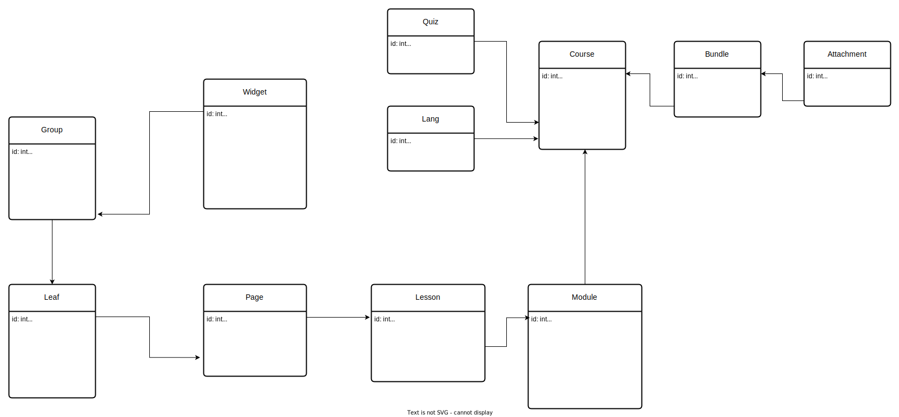
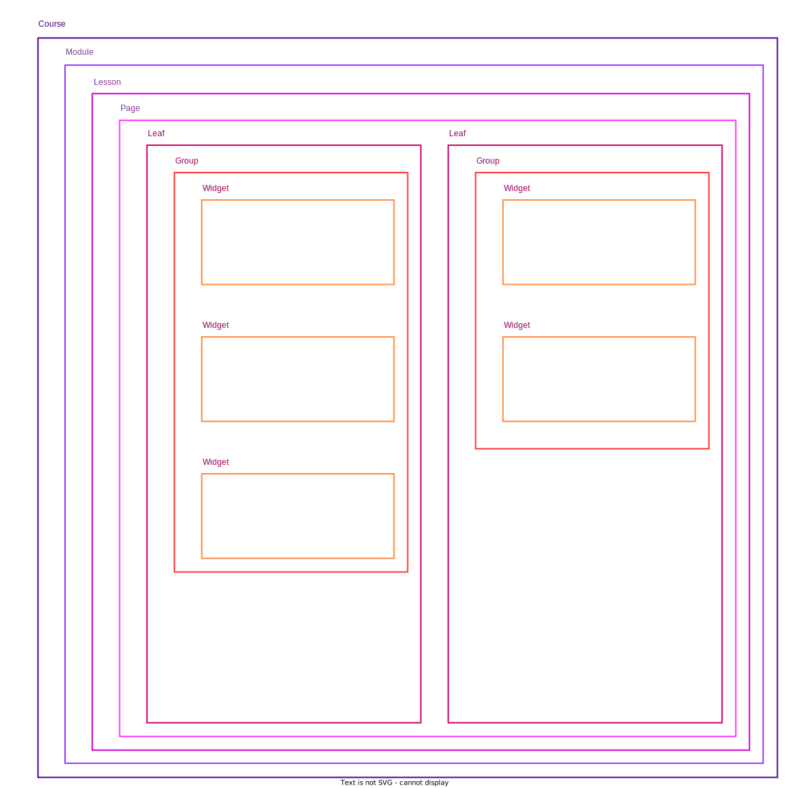
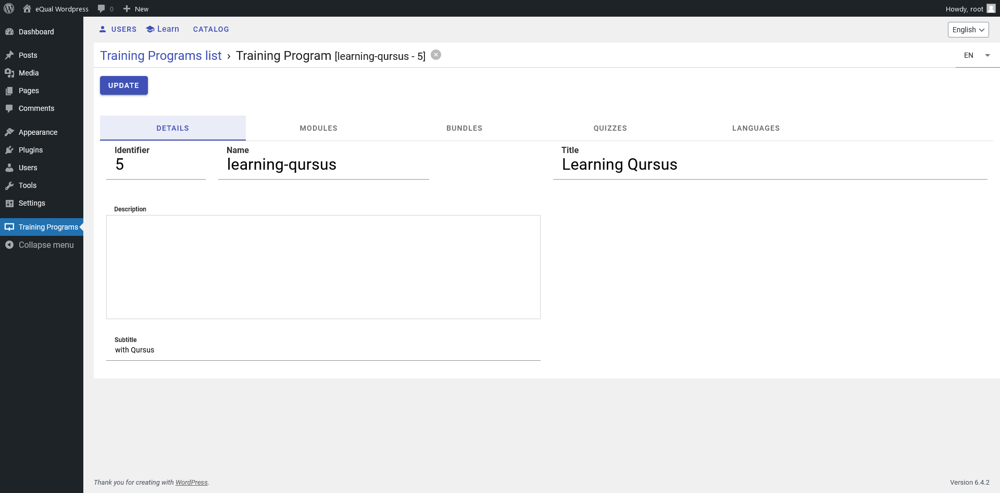
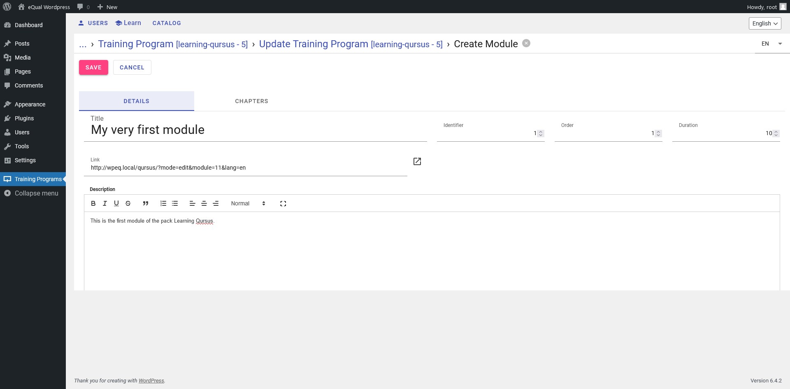
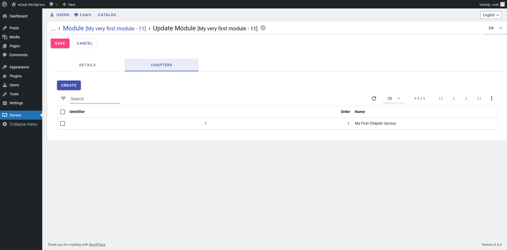
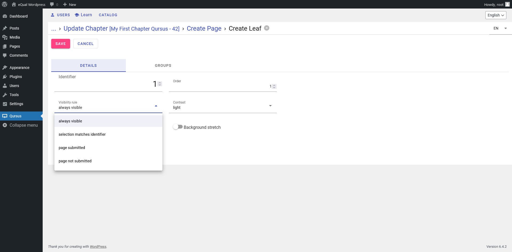
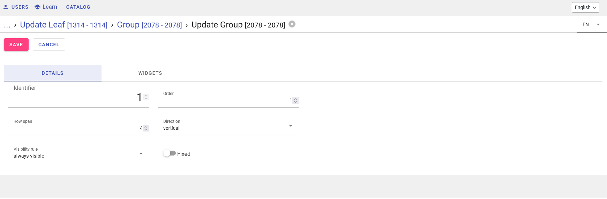
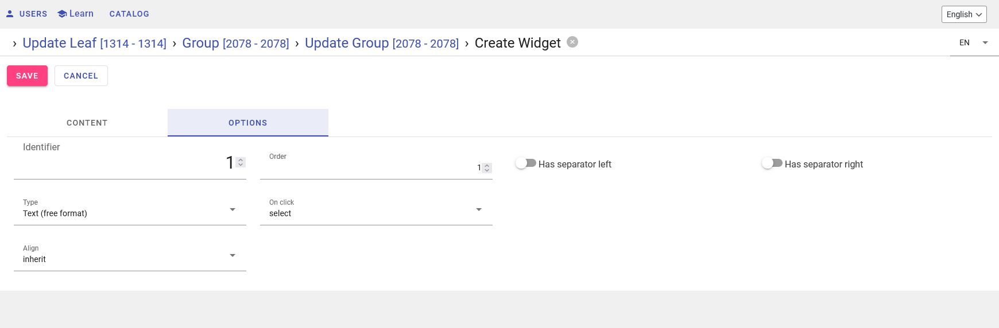

# Learn

[](https://www.gnu.org/licenses/lgpl-3.0)
[](https://github.com/yesbabylon)
[](https://github.com/cedricfrancoys/equal/pulls)
<!--  -->

<a href="https://github.com/equalframework/" style="font-size:2rem;display:flex; align-items:center; wrap; flex-wrap: wrap; flex-shrink:0; text-decoration:none; color:inherit">
Made with eQual
framework 
</a>


## Why Learn :

We needed a way to present people about how to use eQual so we created this app. Ultimately, you will be able to learn
how to use all Symbiose packages and how to use eQual framework by following our module Learn.

## How we propose to solve the problem by using Learn :

Learn uses eQual framework in back-end to get course lesson's. A user can view a lesson if he's the rights there is an edition mode. Every module can be created and edited in the browser, in
command lines or through the api, by a user with the correct credentials.

## How Learn works :

Learn works with eQual on the back-end. The eQual serves the data, auth and controls the views. The student can follow the lesson using the web app that is deployed in /public when the package learn is initiated.

**UML Diagram of the application**



**Schema of the application**

A Learn application contains one or several courses which can contain one or several modules which are themselves divided into lessons and pages. Each page has leaves. Leaves are divided into groups of 8 spaces per
leaf. Those spaces can contain widgets. A widget can be a picture, a text, a title, some code excerpt... A course can
also have a bundle which is basically a zipped piece of attachments (video, pictures, pdf files), the student can download to take the courses.



## Installation

Prerequisite : To install Learn, eQual should be installed. Go to
the [eQual documentation](https://doc.equal.run/getting-started/installation/) installation page.

Then navigate to your eQual in your docker or server instance. Then you need to add learn to the packages. It is currently located in the [symbiose repository on github](https://github.com/yesbabylon/symbiose) under the branch
dev-2.0. Fetch the repo in /packages then init the package learn.

```bash
cd /var/www/html/
git clone https://github.com/yesbabylon/symbiose.git packages
cd /var/www/html/packages
git checkout dev-2.0
git pull
cd /var/www/html/
./equal.run --do=init_package --package=learn
```

Now in your learn package you should see :

```
/packages
    /learn
        /actions
             import.php --> Create Modules, Lessons, Leaves, Pages, Groups and Widgets based on ATModule.json file.
             next.php --> Handle action from user when performing a click to see next page of a given module.
             survey.php --> Send an invite to satisfaction survey.
        /apps
            /learn --> front-end in TypeScript and jQuery web.app that will be unpacked in /public/learn on init
                export.sh -->
                web.app --> zip of the front-end build
                manifest.json
        /classes
            Bundle.class.php
            BundleAttachment.class.php
            Quiz.class.php
            Course.class.php
            Module.class.php
            Lesson.class.php
            Page.class.php
            Leaf.class.php
            Group.class.php
            Widget.class.php
            Lang.class.php
            UserAccess.class.php
            UserStatus.class.php
        /data
            /module
                render.php  --> Returns a fully loaded JSON formatted single module
            /pack
                access.php --> Checks if current user has a license for a given program.
                certificate.php --> Returns a html page or a signed pdf certificate.
                complete.php --> Checks if a course has been fully completed by current user.
                grant.php --> Checks if current user has a license for a given program.
            bundle.php   --> Sends either a single attachment or a zip archive containing all attachments.
            module.php  --> Returns a fully loaded JSON formatted single module.
        /init
            /data
        /views
            Bundle.list.default.json
            Bundle.form.default.json
            ...
            Widget.form.create.default.json
            Widget.form.default.json
            Widget.list.default.json
        config.inc.php --> specify the DEFAULT_PACKAGE constant used for routing
        manifest.json --> usual eQual package manifest
```

## Configuration :

[//]: # (In the context of using equal with Wordpress we need to configure the environnement file and the `.htacces` file.)

The configuration file will indicate what is the back-end api and what is the front-end api.

### a) config.json

**/public/assets/env/config.json**

```json
{
  "production": true,
  "parent_domain": "equal.local",
  "backend_url": "http://equal.local",
  "rest_api_url": "http://equal.local/",
  "lang": "en",
  "locale": "en",
  "company_name": "eQual Framework",
  "company_url": "https://yesbabylon.com",
  "app_name": "eQual.run",
  "app_logo_url": "/assets/img/logo.svg",
  "app_settings_root_package": "core",
  "version": "1.0",
  "license": "AGPL",
  "license_url": "https://www.gnu.org/licenses/agpl-3.0.en.html"
}
```

[//]: # (### b&#41; .htaccess)

[//]: # ()

[//]: # (**/public/.htacces**)

[//]: # ()

[//]: # (```ruby)

[//]: # (Options -Indexes)

[//]: # (DirectoryIndex index.php equal.php index.html)

[//]: # ()

[//]: # (# BEGIN WordPress)

[//]: # (# The directives &#40;lines&#41; between "BEGIN WordPress" and "END WordPress" are)

[//]: # (# dynamically generated, and should only be modified via WordPress filters.)

[//]: # (# Any changes to the directives between these markers will be overwritten.)

[//]: # (<IfModule mod_rewrite.c>)

[//]: # (RewriteEngine On)

[//]: # (RewriteRule .* - [E=HTTP_AUTHORIZATION:%{HTTP:Authorization}])

[//]: # (RewriteBase /)

[//]: # (RewriteRule ^index\.php$ - [L])

[//]: # (RewriteRule ^userinfo$ equal.php [L,QSA])

[//]: # (RewriteRule ^appinfo$ equal.php [L,QSA])

[//]: # (RewriteRule ^envinfo$ equal.php [L,QSA])

[//]: # (RewriteRule ^workbench$ equal.php [L,QSA])

[//]: # (RewriteCond %{REQUEST_FILENAME} !-f)

[//]: # (RewriteCond %{REQUEST_FILENAME} !-d)

[//]: # (RewriteRule . /index.php [L])

[//]: # (</IfModule>)

[//]: # ()

[//]: # (# END WordPress)

[//]: # (```)

[//]: # (### c&#41; config.inc.php)

[//]: # ()

[//]: # (**/packages/learn/config.inc.php**)

[//]: # ()

[//]: # (```php)

[//]: # (<?)

[//]: # (namespace config;)

[//]: # (define&#40;'WEBSITE_URL', 'http://wpeq.local'&#41;;)

[//]: # (define&#40;'WEBSITE_TITLE', 'Learning with Learn'&#41;;)

[//]: # (```)

## Classes and Controllers

Fundamentally the learn application can be schematized this way :

```bash
├─Course
    ├─Lang
    ├─Bundle
        ├─BundleAttachment
    ├─Module
        ├─Lesson
            ├─Page
                ├─Leaves
                    ├─Group
                        ├─Widgets

```


### Course

A course is at the basis of the Learn package. It has a title, a subtitle and languages it is available into. Some (learning)
modules will be attached to the pack. For example, the package **Learning eQual** could have modules called **back-end ,
front-end, low-code, ...**.

[//]: # (To create a pack. You can go to the Wordpress part of your site http://wpeq.local/wp-admin/index.php and create the)

[//]: # (Course with the **YB LMS** plugin installed and activated. Or if you don't have Wordpress, go to the In the dashboard)

[//]: # (menu, select Course and click on the button create. You should get a form and enter the title, the slug of the package)

[//]: # (which should be unique. You can add a subtitle if you wish. Don't forget to click on the save button.)

A course is defined by :

| Field       | Type/Description                                                                                   | Example                                                                                                            |
|-------------|----------------------------------------------------------------------------------------------------|--------------------------------------------------------------------------------------------------------------------|
| name        | Unique slug for the course                                                                         | slug-of-learn-first-pack                                                                                           |
| title       | String (multilang)                                                                                 | Learning Learn                                                                                                     |
| subtitle    | String (multilang)                                                                                 | by using Learn                                                                                                     |
| description | Text                                                                                               | This is a basic description of what is taught in this pack. I can write the numbers and names of the modules, etc. |
| modules     | Alias of modules_ids, the relationship between modules and the pack                                | N/A                                                                                                                |
| modules_ids | Relation one2many, a course can have many modules                                                  | N/A                                                                                                                |
| quizzes_ids | Relation one2many, a course can have many quizzes                                                  | N/A                                                                                                                |
| bundles_ids | Relation one2many, a course can have many bundles                                                  | N/A                                                                                                                |
| langs_ids   | Relation many2many, a course can have many languages and a language can be available in many packs | N/A                                                                                                                |



If the course is deleted, its associated modules and other content related are deleted too.

To create a course or any other entity like a Module or a Lesson, you can also use the usual eQual controllers and replace
it by the appropriate entity name and fields:
http://wpeq.local/equal.php/?do=model_create&entity=learn\Course&fields[state]=draft&lang=en

```bash
./equal.run --do=model_create --entity=learn\Course --fields[state]=draft --lang=en
```

You can the update this model.

The response should be:

```json
{
  "entity": "learn\\Course",
  "id": 6
}
```

You can update the Course entries:

```bash
./equal.run --do=model_update --entity='learn\Course' --ids=6 --fields='{name:"slug-of-the-pack", title:"Title of the Course", subtitle : "Subtitle of the Course", description: "This is a basic description of what is taught in this pack. I can write the numbers and names of the modules and lessons etc." }'
```

**Response**

```json
[
  {
    "id": 6,
    "name": "slug-of-the-pack",
    "title": "Title of the Course",
    "subtitle": " Subtitle of the Course",
    "description": " This is a basic description of what is taught in this pack. I can write the numbers and names of the modules and lessons etc.",
    "langs_ids": " ",
    "modifier": 1,
    "state": "instance",
    "modified": "2023-12-19T10:25:58+00:00"
  }
]
```

Now you can check your newly updated course by using eQual model_collect.

```bash
./equal.run --get=model_collect --entity='learn\Course' --domain=['id','=',6]

```

**Response**

```json
[
  {
    "id": 6,
    "name": "slug-of-the-pack",
    "state": "instance",
    "modified": "2023-12-19T10:28:02+00:00"
  }
]

```

### Languages

You can have a course so a course available in one or several languages. They are defined by the Lang.class.php. A
language has:

| Field      | Type/Description                                             | Example   |
|------------|--------------------------------------------------------------|-----------|
| name       | String (in English)                                          | French    |
| code       | ISO 639-1 language code                                      | fr        |
| course_ids | Relation many2one (the language can be used in many courses) | [1, 2, 3] |

### Quiz

You can create one or many Quizzes for a Course. When the course is deleted so are its quizzes.
They are defined by the Quiz.class.php. A quiz has a

| Field       | Type/Description                                       | Example                                  |
|-------------|--------------------------------------------------------|------------------------------------------|
| identifier  | Integer (unique id for the quiz in the course)         | 1                                        |
| name        | String (in English)                                    | Testing php fundamentals                 |
| quiz-code   | Integer (multilang language code)                      | 1 for English, 2 for French, 3 for Dutch |
| courses_ids | Relation many2one (the quiz can be used in many packs) | [1, 2, 3]                                |

### Bundle and Bundle attachments

You can create one or many Bundles for a course. When the course is deleted so are its Bundles. Basically a Bundle is a
zip folder the student can download. It contains attachments files that are used to take the courses.
They are defined by the Bundle.class.php and BundleAttachment.class.php. A Bundle has:

| Field           | Type/Description                                         | Example                                                                                   |
|-----------------|----------------------------------------------------------|-------------------------------------------------------------------------------------------|
| name            | String                                                   | Bundle Module 1 php fundamentals                                                          |
| description     | Text                                                     | Book of php fundamentals, video tutorial installation of php, Pdf file of php cheat-sheet |
| attachments_ids | Relation many2one (the bundle can have many attachments) | N/A                                                                                       |
| courses_ids     | Relation many2one (the bundle can be used in many packs) | [1, 2, 3]                                                                                 |

When a bundle is deleted the attachment is removed to. A bundle attachment is defined by :

| Field       | Type/Description                                               | Example                                           |
|-------------|----------------------------------------------------------------|---------------------------------------------------|
| name        | String                                                         | Book of php fundamentals by YesBabylon            |
| url         | String (multilang)                                             | https://wpeq.local/learn/assets/images/learn.webp |
| bundles_ids | Relation many2one (the attachment can be used in many bundles) | N/A                                               |

### Module

#### Definition of a Module :

A Module is a major part in the course. It contains lessons. A Module is defined by :

| Field        | Type/Description                                                     | Example                                              |
|--------------|----------------------------------------------------------------------|------------------------------------------------------|
| identifier   | Integer (unique id for the module in the course)                     | N/A                                                  |
| order        | Integer (position of the module in the course)                       | 1                                                    |
| name         | Alias of the title                                                   | N/A                                                  |
| title        | String                                                               | Description of the module as presented to user       |
| link         | Computed field (URL to visual editor of the module)                  | http://wpeq.local/learn/?mode=edit&module=11&lang=en |
| page_count   | Computed Integer (total amount of pages in the module)               | N/A                                                  |
| lesson_count | Computed Integer (total amount of lessons in the module)             | N/A                                                  |
| description  | Text                                                                 | Description of the content of module                 |
| duration     | Integer (indicative duration, in minutes, for completing the module) | N/A                                                  |
| lessons      | Alias of lessons_ids                                                 | N/A                                                  |
| lessons_ids  | Relation one2many (a module can have many lessons)                   | N/A                                                  |
| course_id    | Relation many2one (a module can belong to one course)                | N/A                                                  |

#### Creating a Module :

Select the course you just created, and click on update you can add modules to it.



A module is a major part in your course. It will be divided into lessons and pages.

#### The modules controllers and actions :

### Lesson:

#### Definition of a Lesson:

A Lesson is a major part in the pack. It contains lessons. A lesson is defined by :

| Field        | Type/Description                                         | Example                                        |
|--------------|----------------------------------------------------------|------------------------------------------------|
| identifier   | Integer (unique id for the lesson in the module)         | N/A                                            |
| order        | Integer (position of the lesson in the module)           | 1                                              |
| name         | Alias of the title                                       | N/A                                            |
| title        | String                                                   | Description of the lesson as presented to user |
| page_count   | Computed Integer (total amount of pages in the lesson)   | N/A                                            |
| lesson_count | Computed Integer (total amount of lessons in the lesson) | N/A                                            |
| description  | Text                                                     | Description of the content of lesson           |
| pages        | Alias of pages_ids                                       | N/A                                            |
| pages_ids    | Relation one2many (a lesson can have many pages)         | N/A                                            |
| module_id    | Relation many2one (a lesson can belong to one module)    | N/A                                            |

There are functions for updating the page_count when the pages_ids is updated and/or if module_id is updated.



You can add a page at the same time.

## Page :

### Definition of a page:

A page is a part of a lesson. It can represent a lesson or an exercise for example. It contains leaves.

| Field            | Type/Description                                                                          | Example                                      |
|------------------|-------------------------------------------------------------------------------------------|----------------------------------------------|
| identifier       | Integer (unique id for the page in the lesson)                                            | N/A                                          |
| order            | Integer (position of the page in the lesson)                                              | 5                                            |
| next_active      | Computed field (JSON formatted array of visibility domain for 'next' button)              | N/A                                          |
| title            | String                                                                                    | Description of the page as presented to user |
| next_active_rule | String (select options: always visible; page submitted, item selected, 1 or more actions) | N/A                                          |
| leaves           | Alias of leaves_ids                                                                       | N/A                                          |
| leaves_ids       | Relation one2many (a page can have many leaves)                                           | N/A                                          |
| lesson_id        | Relation many2one (a page can belong to one lesson)                                       | N/A                                          |

A page usually contains two leaves. Pages are displayed flex row with one leaf on the left and a second one on the
right.

## Leaf

Since you can add actions and conditions on visibility.The second leaf's visibility often results of actions from the
user. Those actions are transmitted in the **context**.

A leaf is defined by :

| Field              | Type/Description                                                                                       | Example |
|--------------------|--------------------------------------------------------------------------------------------------------|---------|
| identifier         | Integer (unique id for the leaf in the page)                                                           | N/A     |
| order              | Integer (position of the leaf in the page)                                                             | 1       |
| visible            | Computed field (String, stored)                                                                        | N/A     |
| visibility_rule    | String (select options: always visible; selection matched identifier, page submitted or not submitted) | N/A     |
| groups             | Alias of groups_ids                                                                                    | N/A     |
| groups_ids         | Relation one2many (a leaf can have many groups)                                                        | N/A     |
| background_image   | String (URL of the background image)                                                                   | N/A     |
| background_stretch | Boolean (false by default)                                                                             | N/A     |
| background_opacity | Float (Opacity of the background, from 0 to 1)                                                         | N/A     |
| contrast           | String (select options: dark or light for the background of the leaf)                                  | N/A     |
| page_id            | Relation many2one (a leaf can belong to one page)                                                      | N/A     |



## Group

A leaf can contain one or several groups. A group will take 1 to a maximum of 8 rows in the leaf. The group will contain
widgets.

A Group is defined by :

| Field           | Type/Description                                                   | Example |
|-----------------|--------------------------------------------------------------------|---------|
| identifier      | Integer (unique id for the group in the leaf)                      | N/A     |
| order           | Integer (position of the group in the leaf)                        | 1       |
| direction       | String (can be either vertical or horizontal, default is vertical) | N/A     |
| row_span        | Integer (Height of the group between default 1 and max 8)          | N/A     |
| visible         | Computed field (String, calculated by calcVisible)                 | N/A     |
| visibility_rule | String (select options: same as page visibility_rule)              | N/A     |
| fixed           | Boolean (If true the group is always visible)                      | N/A     |
| widgets         | Alias of widgets_ids                                               | N/A     |
| widgets_ids     | Relation one2many (a group can have many widgets)                  | N/A     |
| leaf_id         | Relation many2one (a group can belong to one leaf)                 | N/A     |



## Widget

A widget is a what you student will see. It can be a text, an excerpt of code, a lesson title, a video, a sound, an
image, a selector



Here is the information you requested, formatted as a Markdown table:

| Field               | Type/Description                                                                                                                                                                                                                                                                                                                                                  | Example |
|---------------------|-------------------------------------------------------------------------------------------------------------------------------------------------------------------------------------------------------------------------------------------------------------------------------------------------------------------------------------------------------------------|---------|
| identifier          | Integer (unique id for the widget in the group)                                                                                                                                                                                                                                                                                                                   | N/A     |
| order               | Integer (position of the widget in the group)                                                                                                                                                                                                                                                                                                                     | 1       |
| content             | Text/plain (Content of the widget in text with markdown support)                                                                                                                                                                                                                                                                                                  | N/A     |
| group_id            | Relation many2one (many widgets can be in one group, widgets are deleted when parent group is deleted)                                                                                                                                                                                                                                                            | N/A     |
| type                | String (select options: 'text', 'code', 'lesson_number', 'lesson_title', 'lesson_description', 'page_title', 'headline', 'subtitle', 'head_text', 'tooltip', 'sound', 'video', 'image_popup', 'first_capital', 'submit_button', 'selector', 'selector_wide', 'selector_yes_no', 'selector_choice', 'selector_section', 'selector_section_wide', 'selector_popup') | N/A     |
| image_url           | String (The widget may need a url if of type 'image_popup', 'selector_popup', 'selector_section', 'selector_section_wide')                                                                                                                                                                                                                                        | N/A     |
| video_url           | String (The widget may need a url if of type 'video')                                                                                                                                                                                                                                                                                                             | N/A     |
| sound_url           | String (The widget may need a url if of type 'sound')                                                                                                                                                                                                                                                                                                             | N/A     |
| has_separator_left  | Boolean                                                                                                                                                                                                                                                                                                                                                           | N/A     |
| has_separator_right | Boolean                                                                                                                                                                                                                                                                                                                                                           | N/A     |
| on_click            | String (select options: 'ignore', 'select_one()', 'submit()', 'image_full()', 'play()')                                                                                                                                                                                                                                                                           | N/A     |

## UserAccess

It is defined by :

| Field          | Type/Description                                                                                             | Example |
|----------------|--------------------------------------------------------------------------------------------------------------|---------|
| code           | Computed field (Integer, unique id used for generating verification url)                                     | N/A     |
| code_alpha     | Computed field (String, retrieve the course based on verification url code of 4 chars (3 letters + 1 digit)) | N/A     |
| course_id      | Relation many2one (many users can access one course)                                                         | N/A     |
| master_user_id | Integer (in case of multiaccounts, external user id)                                                         | N/A     |
| user_id        | Integer (External user identifier that is granted access)                                                    | N/A     |
| is_complete    | Computed field (Boolean, true if the user has finished the programs modules from the UserStatus)             | N/A     |

## UserStatus

Here is the information you provided, formatted as a Markdown table:

| Field          | Type/Description                                                                                             | Example |
|----------------|--------------------------------------------------------------------------------------------------------------|---------|
| id             | Integer (auto-increment)                                                                                     | N/A     |
| code           | Computed field (Integer, unique id used for generating verification url)                                     | N/A     |
| code_alpha     | Computed field (String, retrieve the course based on verification url code of 4 chars (3 letters + 1 digit)) | N/A     |
| course_id      | Relation many2one (many users can access one course)                                                         | N/A     |
| master_user_id | Integer (in case of multiaccounts, external user id)                                                         | N/A     |
| user_id        | Integer (External user identifier that is granted access)                                                    | N/A     |
| is_complete    | Computed field (Boolean, true if the user has finished the programs modules from the UserStatus)             | N/A     |

## NPM scripts

Check the typescript syntax (lint):

`yarn run tsc`

Use babel to transpile .ts file into .js :

`npm run build`

Generate an app.bundle.js that can be embedded to any .html file:

`npm run webpack`