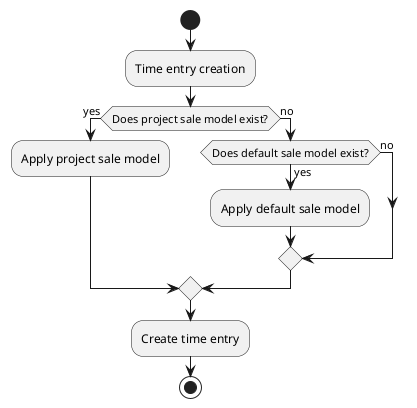

# Time entry sale model

A sale model allows to automatically set the sale information of a new time entry. Its goal is to ease the creation of time entries.

## Details

| Field      | Description                       | Value(s)              |
|------------|-----------------------------------|-----------------------|
| name       | Model name                        |                       |
| origin     | Origin to match for application   | backlog/email/support |
| projects   | Projects to match for application |                       |
| product    | Catalog product to apply          |                       |
| price      | Price to apply                    |                       |
| unit price | Unit price to apply               |                       |

A sale model information can be divided in 2 parts:

1. When should the model apply:
    - Origin (backlog/email/support)
    - Projects

2. Sale data to apply on time entry:
    - Product
    - Price
    - Unit price

## Application logic

Applying a sale model is setting its product, price and unit price values to a time entry.

Notes:

* A **default** sale model is created by setting its origin but not linking it to any project.
* A **project** sale model is created by setting its origin and linking it to one or multiple projects.
