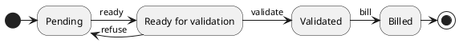

# Time entry

A time entry records the duration of time an employee spent working on a task.
It is an extension of a sale entry, so you can generate a receivable from it that can be used to invoice a customer.

## Details

| Field       | Description                                               | Value(s)                                 |
|-------------|-----------------------------------------------------------|------------------------------------------|
| description | Short description what was done                           |                                          |
| user        | User who realised this entry                              |                                          |
| project     | Project the entry relates to                              |                                          |
| status      | Current status of the entry                               | pending/ready/validated/billed           |
| origin      | Origin of the entry                                       | backlog/email/support                    |
| ticket      | If origin is support a ticket can be linked to the  entry |                                          |
| ticket link | Computed from project.instance.url and ticket             | {instance.url}/support/#/ticket/{ticket} |
| date        | Date                                                      |                                          |
| start       | Start time                                                |                                          |
| end         | End time                                                  |                                          |
| duration    | Duration of time spent                                    | {hours}:{minutes} -> 01:30               |
| product     | Catalog product                                           |                                          |
| price       | Price                                                     |                                          |
| unit price  | Per hour price                                            |                                          |
| receivable  | Generated receivable to invoice customer                  |                                          |

A time entry information can be divided in 2 parts:

1. Time entry data
    - description
    - user
    - project
    - status
    - origin
    - ticket
    - ticket link
    - date
    - start
    - end
    - duration

2. Sale data used to invoice customer
    - product
    - price
    - unit price
    - receivable

### Status workflow:

A time entry has a status that can change following a workflow.
The possible statuses are pending, ready, validated and billed.

## Modifications

The modification of the project automatically sets the customer.

The modification of the duration automatically updates the end time.

The modification of the start time or end time automatically updates the duration.

When the origin and the project are selected a matching sale model is researched.
If a sale model matches it will automatically fill in the time entry sale information: product, price and unit price.

When status is updated to "billed" a receivable is created.

## Actions

| Name               | Description                                                                                                      | Where                  | How                                                                                                                               | Notes                                                                                                                                                    |
|--------------------|------------------------------------------------------------------------------------------------------------------|------------------------|-----------------------------------------------------------------------------------------------------------------------------------|----------------------------------------------------------------------------------------------------------------------------------------------------------|
| Quick create       | Allows to quickly create a time entry from the list view. The new time entry can then be easily modified inline. | Time entries list view | Click on the upper right button "QUICK CREATE"                                                                                    |                                                                                                                                                          |
| Create receivables | Allows to generate time entries' receivables from the list view.                                                 | Time entries list view | 1) Select the rows with the list row checkboxes   2) Click on upper left dropdown "X SELECTED"   3) Click on "Receivable" | Receivables are only created for billable time entries that do not have a receivable yet.                                                                |
| Update status      | Update the status of the time entry following the workflow                                                       | Time entry form view   | Click on the upper right button "READY" / "VALIDATE" / "REFUSE" / "BILL"                                                          | - READY is displayed if status is pending   - VALIDATED and REFUSE are displayed if status is ready   - BILL is displayed if status is validated |
